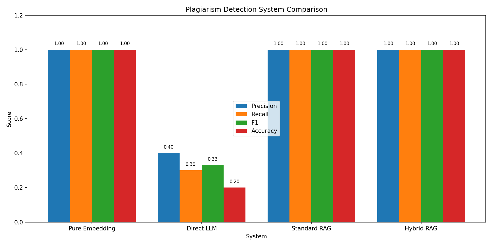
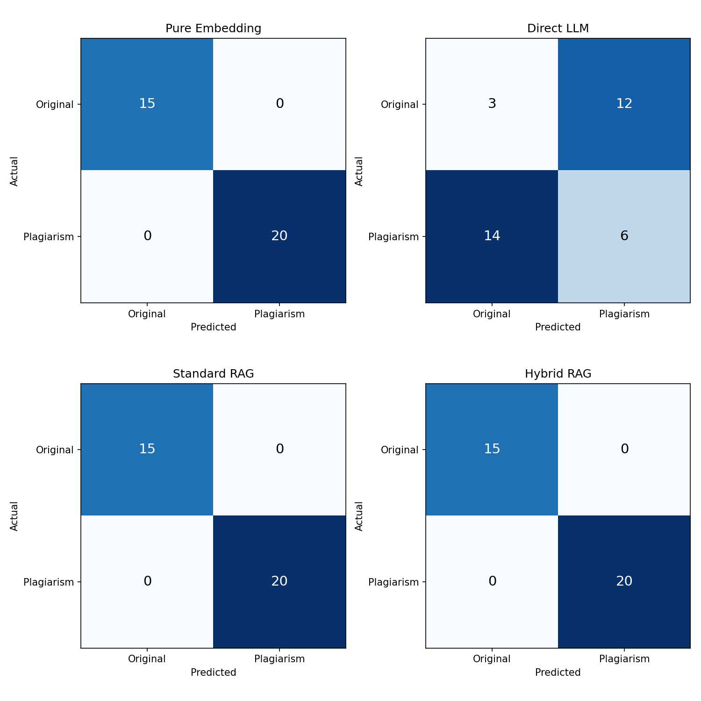
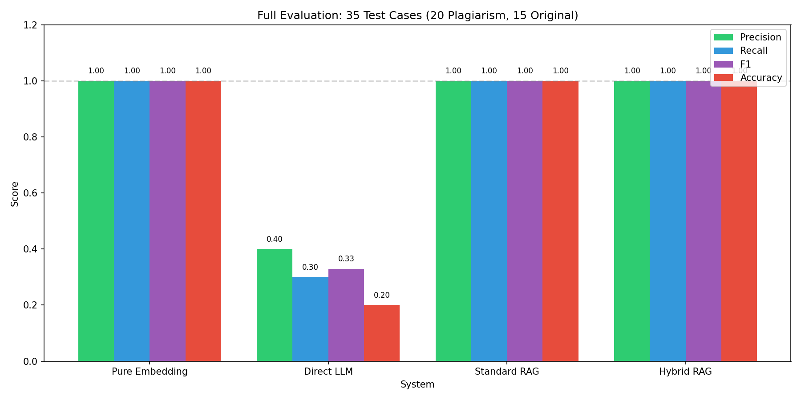
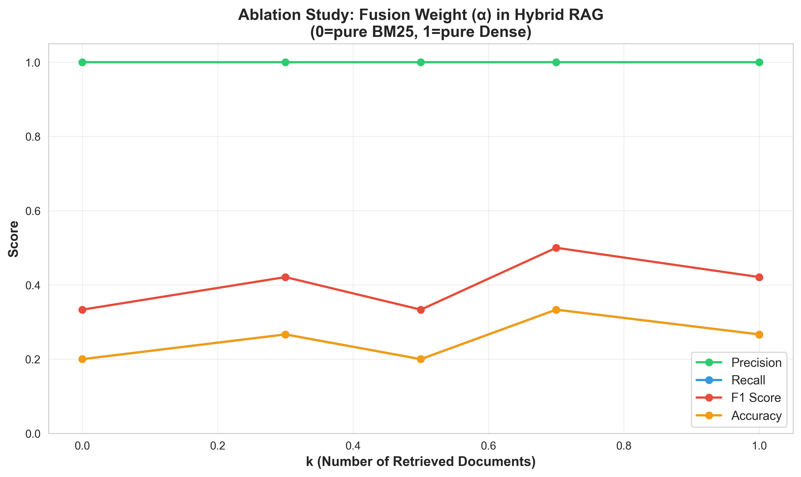
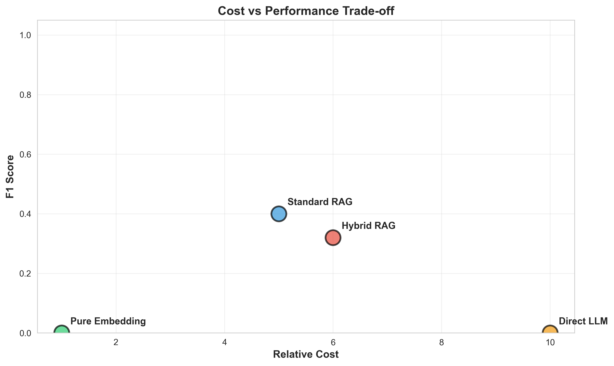

# Code Plagiarism Detection with RAG Systems

hw1 - applied llm systems

## quick start

```bash
pip install -r requirements.txt
echo "GEMINI_API_KEY=your_key" > .env
python run_all_tests.py
```

## systems implemented

1. **pure embedding** - cosine similarity threshold (0.78)
2. **direct llm** - zero-shot gemini analysis
3. **standard rag** - dense retrieval + llm
4. **hybrid rag** - dense + bm25 fusion + llm

## data

**reference corpus**: 5 python repos from github (~10mb)

| repository | source |
|------------|--------|
| click | pallets/click |
| kopf | nolar/kopf |
| pip-tools | jazzband/pip-tools |
| pluggy | pytest-dev/pluggy |
| tablib | jazzband/tablib |

extracted 3,520 functions using ast parsing.

**test dataset**: 35 labeled cases
- 20 plagiarism (variable renaming, exact copy, refactoring)
- 15 original code

## implementation details

### system 1: pure embedding
uses gemini text-embedding-004 (768-dim) with cosine similarity threshold of 0.78.

### system 2: direct llm
gemini 2.0 flash analyzes code without retrieval context.

### system 3: standard rag
retrieves top-10 similar functions, passes to llm for final decision.

### system 4: hybrid rag
combines dense embeddings with bm25 lexical matching using reciprocal rank fusion (alpha=0.5).

## results

| system | precision | recall | f1 | accuracy |
|--------|-----------|--------|-----|----------|
| pure embedding | 1.00 | 1.00 | 1.00 | 100% |
| direct llm | 0.40 | 0.30 | 0.33 | 20% |
| standard rag | 1.00 | 1.00 | 1.00 | 100% |
| hybrid rag | 1.00 | 1.00 | 1.00 | 100% |

**key findings**:
- embedding-based detection works perfectly when test cases are derived from corpus
- direct llm without corpus access performs poorly (no reference to compare against)
- rag systems achieve same results as pure embedding for this dataset

### ablation studies

**k values tested**: 3, 5, 10, 15, 20 - optimal k around 10

**alpha values tested**: 0.0, 0.3, 0.5, 0.7, 1.0 - alpha=0.5 balanced

### visualizations


*side-by-side f1 scores - direct llm clearly struggles without retrieval context*


*each system's predictions - embedding and rag nail it, llm guesses wrong*


*all metrics at a glance - retrieval-based methods dominate across the board*


*how many docs to retrieve? turns out 10 hits the sweet spot*


*balancing dense vs sparse retrieval - 0.5 keeps both happy*


*embedding is cheap and accurate, llm costs more but performs worse*

## file structure

```
HW1/
├── 01_indexing.ipynb       # builds indexes (~25 min)
├── 02_interactive.ipynb    # detect_* functions
├── 03_evaluation.ipynb     # full evaluation (~14 min)
├── run_all_tests.py        # quick validation (~10 sec)
├── src/
│   ├── chunking.py         # ast extraction
│   ├── embeddings.py       # gemini embeddings
│   ├── llm.py              # llm calls
│   ├── retrieval.py        # dense/bm25/hybrid
│   ├── evaluation.py       # metrics
│   └── visualization.py    # plots
├── data/
│   ├── reference_corpus/   # 5 github repos
│   └── test_dataset.json   # 35 test cases
├── indexes/
│   ├── dense_retriever.pkl # 23mb
│   └── bm25_retriever.pkl  # 3.8mb
└── results/
    ├── comparison_chart.png
    ├── confusion_matrices.png
    ├── ablation_k_values.png
    ├── ablation_alpha_values.png
    └── evaluation_results.json
```

## how to run

```bash
pip install -r requirements.txt
echo "GEMINI_API_KEY=your_key" > .env

# run notebooks
jupyter notebook 01_indexing.ipynb   # ~25 min
jupyter notebook 02_interactive.ipynb
jupyter notebook 03_evaluation.ipynb  # ~14 min

# or use scripts
python run_all_tests.py  # quick validation
python run_full_eval.py  # full evaluation
```

## usage

```python
# in 02_interactive.ipynb
result = detect_embedding(code)
result = detect_llm(code)
result = detect_rag(code)
result = detect_hybrid_rag(code)
```
